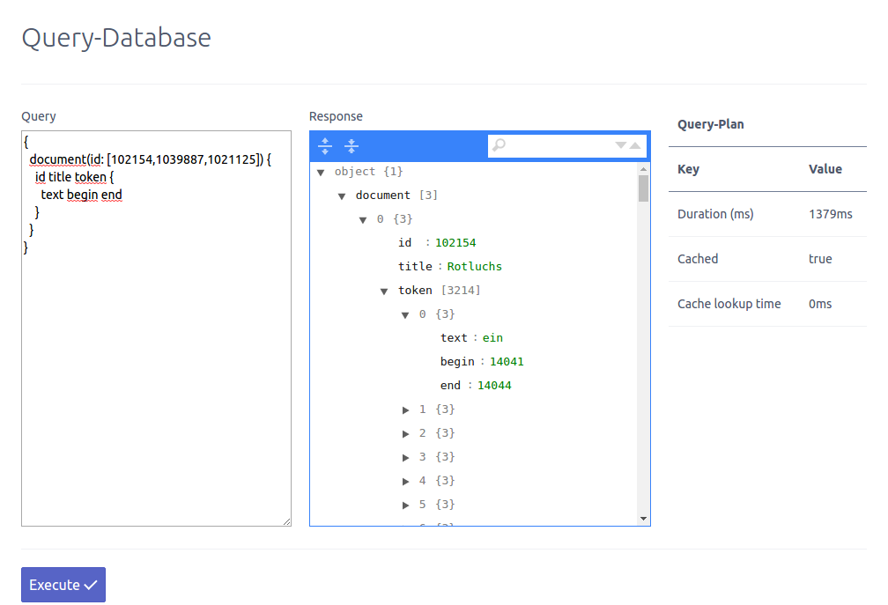

## CasImporter

The application consists of multiple parts:

1. Server
  1. A multi-threaded xmi-importer.
  2. A plug-able storage-engine + query-manger which caches queries and creates simple query-plans (execution time, caching-info, ...).
  3. A plug-able query-language executor.
    1. Storage-engines need to extends an abstract class to make use of this and translate between queries and storage-calls. The AST optimizations must be done within these query-parsers.
    2. Currently GraphQL-language is implemented as an example.
  4. A reference implementation of a storage-engine for redis-api compatible databases.
  5. A http- + rest-server which delivers the query-UI and provides a (CORS-enabled) rest-api to query the database.
2. Client
  1. The integrated Spark server delivers an UI to execute queries against the database (see below) and can be embedded within other parent sites. This is a separate project and based on bower + knockoutjs + spectre.css and should be kept light-weighted.
  2. Shows the query-plan and the returned objects and allows to search them further on the client-side.

